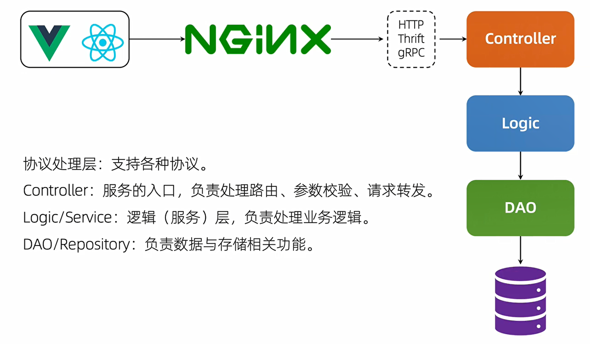

# 基于Gin的问答网站

---
---

## 架构



---

## 项目配置

* 管理配置的第三方库: **viper**
* 配置信息文件: **config.yaml**
* 管理模块的文件: **/config/config.go**

### 1. Viper

参考: https://www.liwenzhou.com/posts/Go/viper_tutorial/

1.1 安装

```
go get github.com/spf13/viper
``` 

1.2 读取配置文件  
Viper支持JSON、TOML、YAML、HCL、envfile和Java properties格式的配置文件。

```
viper.SetConfigFile("./config.yaml")   // 指定配置文件路径
err = viper.ReadInConfig()             // 查找并读取配置文件
```

1.3 定义结构体，将配置信息反序列化到结构体

```
err = viper.Unmarshal(Config)
```

或者使用其他方法获取配置信息

* Get(key string) : interface{}
* GetBool(key string) : bool
* GetFloat64(key string) : float64
* GetInt(key string) : int
* GetIntSlice(key string) : []int
* ...

1.4 监视配置信息  
需要重新启动服务器以使配置生效的日子已经一去不复返了， viper驱动的应用程序可以在运行时读取配置文件的更新，而不会错过任何消息。
只需告诉viper实例watchConfig。可选地，你可以为Viper提供一个回调函数，以便在每次发生更改时运行。

```
viper.WatchConfig()
viper.OnConfigChange(func(e fsnotify.Event) {
    // 配置文件发生变更之后会调用的回调函数
    fmt.Println("Config file changed:", e.Name)
})
```

---

## 日志
* 管理配置的第三方库: **zap**
* 管理模块的文件: **/logger/logger.go**

参考: https://www.liwenzhou.com/posts/Go/zap/

在许多Go语言项目中，我们需要一个好的日志记录器能够提供下面这些功能：

* 能够将事件记录到文件中，而不是应用程序控制台。
* 日志切割-能够根据文件大小、时间或间隔等来切割日志文件。
* 支持不同的日志级别。例如INFO，DEBUG，ERROR等。
* 能够打印基本信息，如调用文件/函数名和行号，日志时间等。

### 1. 标准库的logger

```
import (
    "log"
    "os"
)

func SetupLogger() {
	log.SetFlags(log.Llongfile | log.Lmicroseconds | log.Ldate)
	logFileLocation, _ := os.OpenFile("logger/test.log", os.O_CREATE|os.O_RDWR|os.O_APPEND, 0644)
	log.SetOutput(logFileLocation)
}
```

Go标准库 Logger的优势和劣势

* 优势  
  它最大的优点是使用非常简单。我们可以设置任何io.Writer作为日志记录输出并向其发送要写入的日志。

* 劣势
    * 仅限基本的日志级别  
      只有一个Print选项。不支持INFO/DEBUG等多个级别。
    * 对于错误日志，它有Fatal和Panic  
      Fatal日志通过调用os.Exit(1)来结束程序  
      Panic日志在写入日志消息之后抛出一个panic  
      但是它缺少一个ERROR日志级别，这个级别可以在不抛出panic或退出程序的情况下记录错误
    * 缺乏日志格式化的能力——例如记录调用者的函数名和行号，格式化日期和时间格式。等等。
    * 不提供日志切割的能力。

### 2. Uber-go Zap

* 它同时提供了结构化日志记录和printf风格的日志记录
* 它非常的快，根据Uber-go Zap的文档，它的性能比类似的结构化日志包更好——也比标准库更快。

2.1 安装

```
go get -u go.uber.org/zap
```

2.2 定制logger
> zapcore.Core 需要三个配置——**Encoder**， **WriteSyncer**， **LogLevel**。  
> Encoder: 编码器(如何写入日志)。我们将使用开箱即用的NewJSONEncoder()，
> 并使用预先设置的ProductionEncoderConfig()。  
> WriterSyncer ：指定日志将写到哪里去。我们使用zapcore.AddSync()函数并且将打开的文件句柄传进去。  
> Log Level：哪种级别的日志将被写入。

* core配置其1: 编码器(如何写入日志)

```
// getEncoder 编码器(如何写入日志)
func getEncoder() zapcore.Encoder {
	encoderConfig := zap.NewProductionEncoderConfig()
	encoderConfig.EncodeTime = zapcore.ISO8601TimeEncoder         // 将时间格式设置为人类可读的格式
	encoderConfig.TimeKey = "time"                                // 输出时间的key名
	encoderConfig.EncodeLevel = zapcore.CapitalLevelEncoder       // 在日志文件中使用大写字母记录日志级别
	encoderConfig.EncodeDuration = zapcore.SecondsDurationEncoder // 一般设置为这个, 执行消耗的时间转化成浮点型的秒
	encoderConfig.EncodeCaller = zapcore.ShortCallerEncoder       // 以包/文件:行号 格式化调用堆栈
	return zapcore.NewJSONEncoder(encoderConfig)
}
```

* core配置其2: 指定日志输出文件

> 为了添加日志切割归档功能，我们将使用第三方库Lumberjack来实现。  
> 安装: `go get gopkg.in/natefinch/lumberjack.v2`

```
// getLogWriter 设置日志写入文件
func getLogWriter(filename string, maxSize, maxBackup, maxAge int) zapcore.WriteSyncer {
    lumberJackLogger := &lumberjack.Logger{
        Filename:   filename,
        MaxSize:    maxSize,
        MaxBackups: maxBackup,
        MaxAge:     maxAge,
    }
    return zapcore.AddSync(lumberJackLogger)
}
```

* core配置其3: 设置日志的级别

```
var l = new(zapcore.Level)
err = l.UnmarshalText([]byte(config.Level))
if err != nil {
    return
}
```

* 配置 core，需要能够在终端和文件中输出

```
// 输出到终端的 core
consoleEncoder := zapcore.NewConsoleEncoder(zap.NewDevelopmentEncoderConfig())
// 自己定制的 core
core = zapcore.NewTee(
    zapcore.NewCore(encoder, writeSyncer, l),
    zapcore.NewCore(consoleEncoder, zapcore.Lock(os.Stdout), zapcore.DebugLevel),
)
```

* 生成日志实例，并替换全局logger实例

```
// 生成日志实例
lg = zap.New(core, zap.AddCaller()) // 添加将调用函数信息记录到日志中的功能
zap.ReplaceGlobals(lg)              // 替换zap包中全局的logger实例，后续在其他包中只需使用zap.L()调用即可
```

* 接收gin框架默认日志

```
// GinLogger 接收gin框架默认的日志
func GinLogger() gin.HandlerFunc {
    return func(c *gin.Context) {
        start := time.Now()
        path := c.Request.URL.Path
        query := c.Request.URL.RawQuery
        c.Next()
        cost := time.Since(start)
        lg.Info(path,
            zap.Int("status", c.Writer.Status()),
            zap.String("method", c.Request.Method),
            zap.String("path", path),
            zap.String("query", query),
            zap.String("ip", c.ClientIP()),
            zap.String("user-agent", c.Request.UserAgent()),
            zap.String("errors", c.Errors.ByType(gin.ErrorTypePrivate).String()),
            zap.Duration("cost", cost),
        )
    }
}
```

* 替换掉原Recovery
```
// GinRecovery recover掉项目可能出现的panic，并使用zap记录相关日志
func GinRecovery(stack bool) gin.HandlerFunc {
    return func(c *gin.Context) {
        defer func() {
            if err := recover(); err != nil {
                // Check for a broken connection, as it is not really a
                // condition that warrants a panic stack trace.
                var brokenPipe bool
                if ne, ok := err.(*net.OpError); ok {
                    if se, ok := ne.Err.(*os.SyscallError); ok {
                        if strings.Contains(strings.ToLower(se.Error()), "broken pipe") || strings.Contains(strings.ToLower(se.Error()), "connection reset by peer") {
                            brokenPipe = true
                        }
                    }
                }
        
                httpRequest, _ := httputil.DumpRequest(c.Request, false)
                if brokenPipe {
                    lg.Error(c.Request.URL.Path,
                        zap.Any("error", err),
                        zap.String("request", string(httpRequest)),
                    )
                    // If the connection is dead, we can't write a status to it.
                    c.Error(err.(error)) // nolint: errcheck
                    c.Abort()
                    return
                }
        
                if stack {
                    lg.Error("[Recovery from panic]",
                        zap.Any("error", err),
                        zap.String("request", string(httpRequest)),
                        zap.String("stack", string(debug.Stack())),
                    )
                } else {
                    lg.Error("[Recovery from panic]",
                        zap.Any("error", err),
                        zap.String("request", string(httpRequest)),
                    )
                }
                c.AbortWithStatus(http.StatusInternalServerError)
            }
          }()
        c.Next()
    }
}
```

2.3 logger的使用  
使用全局logger: `zap.L()`
* `zap.L().Error("string", zap.Error(err))`
* `zap.L().Info()`
* `zap.L().Fatal()`

---

## 数据库(DAO层)
### 1. MySQL
参考: https://www.liwenzhou.com/posts/Go/sqlx/
> 在项目中我们通常可能会使用database/sql连接MySQL数据库。  
> sqlx可以认为是Go语言内置database/sql的超集。

1.1 安装  
```
go get github.com/jmoiron/sqlx
```

1.2 连接数据库
```
var db *sqlx.DB
// Init 初始化MySQL
func Init(config *config.MySQLConfig) (err error) {
    dsn := fmt.Sprintf("%s:%s@tcp(%s:%d)/%s?charset=utf8mb4&parseTime=True",
        config.User,
        config.Password,
        config.Host,
        config.Port,
        config.DbName,
    )
    db, err = sqlx.Connect("mysql", dsn)
    if err != nil {
        zap.L().Error("connect DB failed", zap.Error(err))
        return
    }
    db.SetMaxOpenConns(config.MaxOpenConns)
    db.SetMaxIdleConns(config.MaxIdleConns)
    return
}
```

1.3 使用
> 查询占位符?在内部称为bindvars（查询占位符）,它非常重要。你应该始终使用它们向数据库发送值，因为它们可以防止SQL注入攻击。
> bindvars是特定于数据库的，如PostgreSQL使用枚举的$1、$2等bindvar语法
* 查询            `err := db.Get(&DataModel/&DataModels, sqlStr, params)`
* 插入、更新和删除  `ret, err := db.Exec(sqlStr, params)` 
* db.NamedExec: 用来绑定SQL语句与结构体或map中的同名字段
```
sqlStr := "INSERT INTO user (name,age) VALUES (:name,:age)"
_, err = db.NamedExec(sqlStr,
    map[string]interface{}{
        "name": "bob",
        "age": 18,
    })
```
* db.NamedQuery: 查询
```
sqlStr := "SELECT * FROM user WHERE name=:name"
// 使用map做命名查询
rows, err := db.NamedQuery(sqlStr, map[string]interface{}{"name": "Bob"})
defer rows.Close()
for rows.Next(){
    var u user
    err := rows.StructScan(&u)
    fmt.Printf("user:%#v\n", u)
}
```
* 事务  
  对于事务操作，我们可以使用sqlx中提供的`db.Beginx()`和`tx.Exec()`方法。  
  `tx, err := db.Beginx() // 开启事务`, `res, err := tx.Exec(sqlStr, params)`, `tx.Rollback()`
* 使用sqlx.In实现批量插入

### 2. Redis
参考: https://www.liwenzhou.com/posts/Go/redis/  

2.1 安装
```
go get github.com/go-redis/redis
```

2.2 连接
```
var rdb *redis.Client
// Init 初始化连接
func Init(config *config.RedisConfig) (err error) {
    rdb = redis.NewClient(&redis.Options{
        Addr:     fmt.Sprintf("%s:%d", config.Host, config.Port),
        Password: config.Password,
        DB:       config.DB,
        PoolSize: config.PoolSize,
    })
    _, err = rdb.Ping().Result()
    if err != nil {
        zap.L().Error("connect Redis failed", zap.Error(err))
        return
    }
    return
}
```

2.3 使用  
略

---

## 注册路由
本项目使用gin框架
### 1. gin框架
参考: https://www.liwenzhou.com/posts/Go/gin/  

1.1 安装
```
go get -u github.com/gin-gonic/gin
```

1.2 创建定制引擎
```
r := gin.New()
```

1.3 注册全局中间件
```
r.Use(logger.GinLogger(), logger.GinRecovery(true))
```

1.4 注册路由组以及路由组中间件
```
api := r.Group("/api")
api.Use(middlewares.JWTAuthMiddleware()) // 应用JWT认证中间件
```

完整代码如下:  
```
func Setup(mode string) *gin.Engine {
	if mode == gin.ReleaseMode {
		// gin设置成发布模式
		gin.SetMode(gin.ReleaseMode)
	}
	// 创建一个自定义的引擎
	r := gin.New()
	// 注册全局中间件
	r.Use(logger.GinLogger(), logger.GinRecovery(true))
	// 注册路由组
	api := r.Group("/api")
	// api下的所有路由在这里写
	{
		api.GET("/", func(context *gin.Context) {
			context.JSON(http.StatusOK, gin.H{
				"data": "seccess",
			})
		})
	}
	return r
}
```

## 启动服务
```
// 启动服务
srv := &http.Server{
    Addr:    fmt.Sprintf(":%d", config.Port),
    Handler: r,
}

go func() {
    // 开启一个goroutine启动服务
    if err := srv.ListenAndServe(); err != nil && err != http.ErrServerClosed {
        zap.L().Error("listen: %s\n", zap.Error(err))
    }
}()

// 等待中断信号来优雅地关闭服务器，为关闭服务器操作设置一个5秒的超时
quit := make(chan os.Signal, 1) // 创建一个接收信号的通道
// kill 默认会发送 syscall.SIGTERM 信号
// kill -2 发送 syscall.SIGINT 信号，我们常用的Ctrl+C就是触发系统SIGINT信号
// kill -9 发送 syscall.SIGKILL 信号，但是不能被捕获，所以不需要添加它
// signal.Notify把收到的 syscall.SIGINT或syscall.SIGTERM 信号转发给quit
signal.Notify(quit, syscall.SIGINT, syscall.SIGTERM) // 此处不会阻塞
<-quit                                               // 阻塞在此，当接收到上述两种信号时才会往下执行
zap.L().Info("Shutdown Server ...")
// 创建一个5秒超时的context
ctx, cancel := context.WithTimeout(context.Background(), 5*time.Second)
defer cancel()
// 5秒内优雅关闭服务（将未处理完的请求处理完再关闭服务），超过5秒就超时退出
if err := srv.Shutdown(ctx); err != nil {
    zap.L().Fatal("Server Shutdown: ", zap.Error(err))
}

zap.L().Info("Server exiting")
```

---

## 参数校验
参考: https://www.liwenzhou.com/posts/Go/validator_usages/

使用validator库做参数校验的一些十分实用的使用技巧，包括翻译校验错误提示信息、自定义提示信息的字段名称、自定义校验方法等。

### 1. 使用
gin框架使用https://github.com/go-playground/validator进行参数校验，
我们需要在定义结构体时使用 `binding` 标识相关校验规则，
可以查看https://godoc.org/github.com/go-playground/validator#hdr-Baked_In_Validators_and_Tags
文档查看支持的所有 tag。